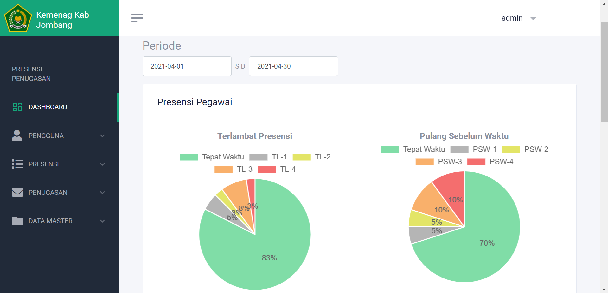
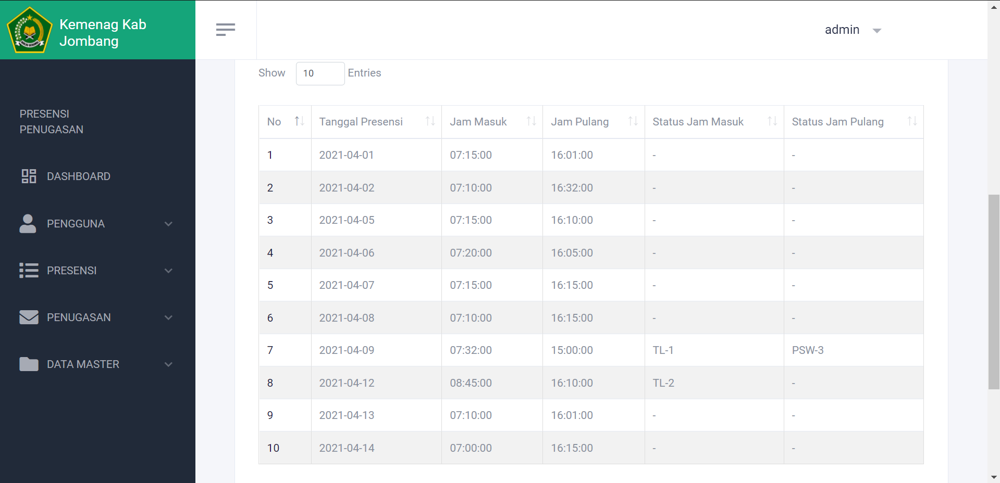
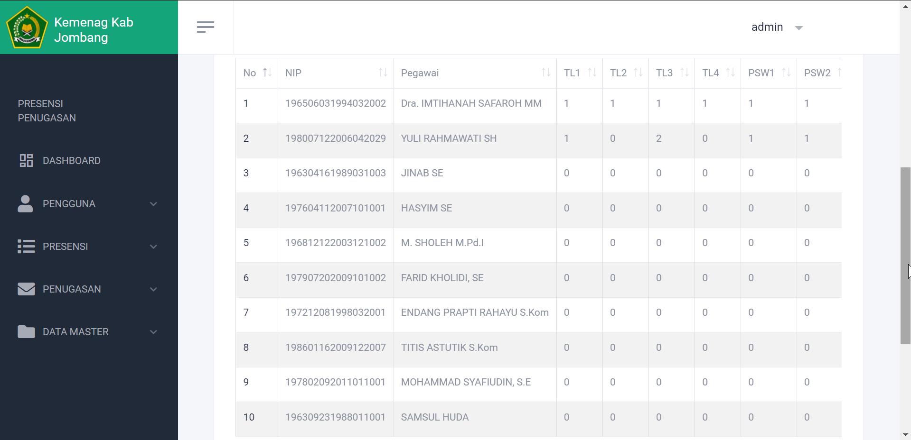

## Usage Application
> To manage and recap attendance data starting from employee data, rules, place and time attendance.

## How to run project
1. composer install
2. php artisan migrate
3. php artisan serve

## Screenshots

  
  
  

## Application Features
- Login
- Manage employee data
- Manage attendance data like rules, place, and time
- Recap pdf and excel attendance data

## Framework & Libraries
- Laravel 7.0
- Jquery
- Boostrap
- Yajra Datatable
- Dompdf
- Maatwebsite Excel